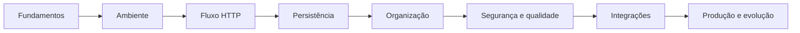

# Plano mestre

Este documento define a arquitetura editorial e a direção operacional do
Laravel Roadmap. Ele orienta a criação futura dos capítulos, mas não substitui o
[roadmap de estudos](ROADMAP.md), o [guia de estilo](STYLE_GUIDE.md) nem os
critérios de contribuição descritos em [CONTRIBUTING.md](CONTRIBUTING.md).

Os títulos e blocos futuros apresentados aqui são planejamento. Eles não devem
ser transformados em arquivos vazios e não representam conteúdo concluído.

## Objetivo do projeto

Construir uma trilha progressiva de aprendizagem e uma referência técnica sobre
Laravel que una cinco formas complementares de estudo:

1. capítulos conceituais em `docs/`;
2. exemplos isolados em `examples/`;
3. exercícios dentro dos capítulos;
4. laboratórios orientados em `labs/`;
5. uma aplicação ambulatorial evolutiva em `project/`.

O livro deve ensinar a compreender decisões, e não apenas reproduzir comandos.
Cada assunto deve explicar o que é, por que existe, quando usar e quando evitar.
Inteligência Artificial deve apoiar esse processo como uma camada transversal,
sempre acompanhada de compreensão, revisão e validação.

## Público-alvo

O conteúdo é destinado a pessoas que:

- conhecem a sintaxe básica de PHP;
- tiveram contato inicial com Laravel;
- ainda estão consolidando orientação a objetos e arquitetura de aplicações;
- desejam sair de exemplos isolados para uma aplicação organizada e testável.

Não se pressupõe experiência avançada com infraestrutura, padrões de projeto ou
funcionamento interno do framework. Conceitos essenciais dessas áreas devem ser
introduzidos antes de serem exigidos.

## Filosofia do roadmap

O roadmap segue estes princípios:

- **progressão antes de abrangência:** apresentar uma base utilizável antes de
  introduzir recursos avançados;
- **conceito antes da automação:** explicar o problema antes do comando ou da
  abstração que o resolve;
- **prática em camadas:** observar em exemplo isolado, praticar em laboratório e
  integrar na aplicação progressiva;
- **complexidade justificada:** adicionar camadas arquiteturais somente quando o
  problema atual demonstrar sua necessidade;
- **domínio consistente:** usar a gestão ambulatorial para reduzir a troca de
  contexto entre assuntos;
- **conteúdo geral durável:** manter conceitos gerais independentes da versão do
  framework;
- **especificidade verificável:** registrar afirmações exclusivas do Laravel 13
  somente após confirmação em documentação oficial;
- **evidência de progresso:** marcar como concluído apenas o que existir e puder
  ser revisado no repositório.

## Uso de Inteligência Artificial

A IA faz parte de todas as fases do roadmap como apoio ao desenvolvimento
profissional. Ela não constitui uma fase isolada e não substitui os fundamentos
necessários para compreender o problema.

Todo capítulo técnico futuro deve conter a seção obrigatória `IA em Ação`,
seguindo o `STYLE_GUIDE.md`. Nela, o leitor deverá observar não apenas o que a IA
propôs, mas como um desenvolvedor revisou e validou a proposta.

Essa camada deve registrar:

- o objetivo delimitado do uso da IA;
- o prompt utilizado;
- um resumo da resposta;
- a análise crítica das premissas e escolhas;
- possíveis erros, omissões e riscos;
- melhorias justificadas;
- a versão final recomendada e sua forma de validação.

O nível de uso da IA deve acompanhar a maturidade do assunto. Ela pode começar
como assistência, avançar para produtividade e revisão e, quando houver contexto
suficiente, apoiar discussões arquiteturais e ciclos de parceria. Em todos os
níveis, autoria e responsabilidade permanecem com o desenvolvedor.

O princípio permanente é:

> **Nunca aceite uma resposta da IA sem compreendê-la.**

O `AI_GUIDE.md` define os níveis de utilização, o ciclo de trabalho, as
evidências de validação e os cuidados com privacidade e segurança.

## Estrutura por fases

A arquitetura do livro acompanha as fases do `ROADMAP.md`. Cada fase pode conter
mais de um capítulo, exemplo ou laboratório, mas deve produzir um resultado de
aprendizagem identificável.

| Fase | Eixo editorial | Resultado esperado |
| --- | --- | --- |
| 1. Fundamentos | proposta do Laravel, estrutura, Artisan e orientação a objetos | compreender o vocabulário e localizar responsabilidades |
| 2. Ambiente | PHP, Composer, MySQL, Docker e criação da aplicação | executar e inspecionar a aplicação localmente |
| 3. Fluxo HTTP | requisições, rotas, Controllers, Blade, formulários e validação | entregar um fluxo web simples sem persistência completa |
| 4. Persistência | banco de dados, migrations, Eloquent, relacionamentos e CRUD | persistir o primeiro fluxo ambulatorial |
| 5. Organização | regras de negócio, service container, eventos e filas | separar responsabilidades conforme problemas concretos |
| 6. Segurança e qualidade | autenticação, autorização, testes e análise de código | proteger e verificar os fluxos essenciais |
| 7. Integrações | APIs, serviços externos, cache e processamento assíncrono | integrar a aplicação com tolerância a falhas |
| 8. Produção | deploy, servidor web, observabilidade, backup e atualização | operar e evoluir a aplicação com segurança |

Uma fase só deve exigir conhecimentos ensinados ou declarados como
pré-requisitos nas fases anteriores.

## Ordem pedagógica

A sequência principal parte da compreensão, avança para uma entrega mínima e
só então introduz organização e operação avançadas:

Dentro de cada assunto, a ordem recomendada é:

1. apresentar o problema e o vocabulário;
2. explicar o funcionamento essencial;
3. mostrar um exemplo mínimo;
4. aplicar o conceito ao domínio ambulatorial;
5. discutir limites, erros comuns e alternativas;
6. verificar o aprendizado com exercícios;
7. integrar o conceito na aplicação quando houver base para isso.

Assuntos avançados podem ser consultados separadamente, mas o percurso de
aprendizagem não deve depender de saltos para capítulos futuros.

## Dependências entre capítulos

Os identificadores abaixo representam posições editoriais, não nomes de arquivos
obrigatórios. Apenas os três primeiros capítulos já existem.

| Bloco | Assunto | Depende de |
| --- | --- | --- |
| F1.1 | Introdução ao Laravel | conhecimentos básicos indicados ao leitor |
| F1.2 | Estrutura do Laravel | F1.1 |
| F1.3 | PHP Artisan | F1.2 |
| F1.4 | Orientação a objetos para a trilha | fundamentos de PHP |
| F2.1 | Ambiente de desenvolvimento | F1.2 e F1.3 |
| F2.2 | Criação e execução da aplicação | F2.1 |
| F3.1 | HTTP, requisições e respostas | F1.1 e F2.2 |
| F3.2 | Rotas | F3.1 |
| F3.3 | Controllers e injeção básica | F1.4 e F3.2 |
| F3.4 | Blade e composição de interface | F3.1 e F3.3 |
| F3.5 | Formulários e validação | F3.2, F3.3 e F3.4 |
| F4.1 | Banco de dados e migrations | F2.1 e F2.2 |
| F4.2 | Models e Eloquent | F1.4 e F4.1 |
| F4.3 | Relacionamentos | F4.2 |
| F4.4 | CRUD de Paciente | F3.5, F4.2 e F4.3 quando aplicável |
| F5 | Organização das regras da aplicação | fluxo CRUD funcional da F4 |
| F6 | Segurança e testes | fluxos organizados da F5 |
| F7 | APIs e integrações | segurança e testes da F6 |
| F8 | Produção e evolução | aplicação integrada e verificável da F7 |

Antes de criar um capítulo futuro, suas dependências devem ser detalhadas. Se
uma dependência ainda não estiver disponível, o capítulo deve aguardar ou
declarar um pré-requisito externo compatível com o público-alvo.

## Critérios para considerar um capítulo concluído

Um capítulo está concluído somente quando:

- possui objetivo e escopo claros;
- declara pré-requisitos relevantes;
- explica o que é, por que existe, quando usar e quando evitar;
- respeita as dependências e o nível de conhecimento do leitor;
- inclui funcionamento interno na profundidade necessária para o assunto;
- apresenta exemplo mínimo e aplicação ambulatorial quando fizer sentido;
- discute erros comuns, limites e boas práticas relevantes;
- separa conteúdo geral de observações específicas de versão;
- referencia documentação oficial para afirmações exclusivas do Laravel 13;
- possui resumo e exercícios alinhados aos objetivos;
- contém a seção `IA em Ação` com análise crítica e validação, quando for um
  capítulo técnico;
- segue o `STYLE_GUIDE.md`, sem links quebrados ou código incompleto;
- teve seus exemplos executáveis verificados no ambiente previsto;
- passou por revisão técnica, pedagógica e textual.

Ter um arquivo criado ou um rascunho parcial não torna o capítulo concluído. O
status no roadmap só deve ser atualizado depois da validação desses critérios.

## Estratégia de evolução do projeto Laravel

A aplicação em `project/` deve crescer junto com o livro, sem antecipar soluções
que ainda não foram explicadas. A evolução planejada é:

1. manter o diretório reservado até o capítulo de ambiente;
2. criar uma instalação mínima e reproduzível quando essa etapa for autorizada;
3. configurar ambiente e banco sem incluir segredos no Git;
4. entregar primeiro uma resposta HTTP simples;
5. introduzir interface e validação antes da persistência completa;
6. implementar o cadastro de Paciente como primeiro fluxo vertical;
7. adicionar Atendimento, Prontuário, Receita, Médico, Enfermeiro e Usuário
   conforme seus relacionamentos forem ensinados;
8. extrair regras e serviços apenas quando a aplicação demonstrar essa
   necessidade;
9. acrescentar segurança, testes, filas, APIs e observabilidade nas fases
   correspondentes;
10. preparar produção somente depois que os fluxos principais forem testáveis.

Cada incremento deve indicar o capítulo e o laboratório que o justificam. Os
exemplos em `examples/` não devem se transformar em uma segunda aplicação.

## Estratégia de versionamento

O projeto adota estas diretrizes:

- usar o `CHANGELOG.md` no formato Keep a Changelog para mudanças relevantes;
- manter alterações ainda não publicadas em `Unreleased`;
- adotar Versionamento Semântico quando houver publicações formais;
- usar tags apenas para estados revisados e reproduzíveis do material;
- registrar mudanças exclusivas de cada versão principal do Laravel em
  `versions/laravel-N.md`;
- não duplicar conceitos gerais dentro de documentos de versão;
- validar requisitos, incompatibilidades e mudanças de framework em fontes
  oficiais antes de atualizar exemplos e a aplicação;
- planejar a migração da aplicação separadamente da atualização editorial.

Uma futura troca de versão de referência deve incluir análise de impacto nos
capítulos, laboratórios, exemplos, Docker e aplicação progressiva.

## Ideias futuras

Estas ideias não representam compromisso nem autorização para criar arquivos:

- índice temático além da leitura sequencial;
- glossário de termos de PHP, HTTP, banco de dados e Laravel;
- mapas visuais entre capítulos e componentes da aplicação;
- soluções comentadas para exercícios em local separado e de acesso opcional;
- trilhas alternativas para API e aplicação web tradicional;
- matrizes de compatibilidade entre versões suportadas;
- automação para validar links, Markdown e exemplos executáveis;
- ambiente de demonstração reproduzível;
- anexos sobre diagnóstico, desempenho e segurança operacional.

Cada ideia deve ser avaliada pelo valor pedagógico e pelo custo de manutenção
antes de entrar no roadmap.

## Itens pendentes

- [ ] Validar a ordem e a granularidade dos blocos planejados com revisão humana.
- [ ] Confirmar oficialmente os requisitos técnicos do Laravel 13 antes de fixar
  a versão do PHP.
- [ ] Definir o ambiente Docker sem instalar a aplicação antecipadamente.
- [ ] Definir quando o primeiro release editorial será publicado.
- [ ] Escolher critérios de automação para revisão de Markdown e links.
- [ ] Decidir se as soluções dos exercícios serão públicas e onde ficarão.
- [ ] Detalhar os capítulos da próxima fase somente quando ela for iniciada.
- [ ] Revisar os laboratórios existentes após a criação da aplicação real.
- [ ] Definir Apache ou Nginx como primeira referência prática de produção.

## Decisões arquiteturais

As decisões atuais são:

| Decisão | Motivo | Estado |
| --- | --- | --- |
| Separar livro, exemplos, laboratórios e aplicação | cada formato cumpre uma função pedagógica diferente | aceita |
| Usar gestão ambulatorial como domínio principal | preserva contexto entre capítulos e permite evolução gradual | aceita |
| Manter a aplicação Laravel em `project/` | evita misturar a raiz editorial com a raiz do framework | aceita |
| Manter conceitos gerais fora de `versions/` | reduz duplicação e envelhecimento desnecessário do livro | aceita |
| Usar Laravel 13 como referência atual | oferece uma base técnica comum para exemplos futuros | aceita, sujeita a verificação oficial |
| Adiar abstrações até existir um problema concreto | torna a arquitetura compreensível para o público-alvo | aceita |
| Não criar capítulos vazios | o Git deve refletir progresso real, não apenas intenção | aceita |
| Usar Docker no desenvolvimento | busca um ambiente reproduzível para a aplicação progressiva | aceita, implementação pendente |
| Suportar Apache ou Nginx em produção | mantém a arquitetura independente de um único servidor web | aceita, referência inicial pendente |

Novas decisões que afetem a estrutura do livro ou da aplicação devem registrar
contexto, alternativas consideradas, consequência pedagógica e estado. Mudanças
relevantes também devem aparecer no `CHANGELOG.md`. Os registros formais ficam
em [`decisions/`](decisions/README.md) e seguem o modelo disponível em
`templates/decision-template.md`.
